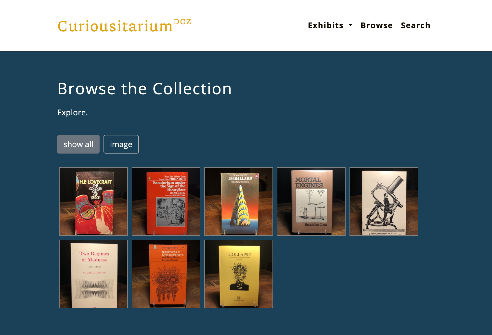
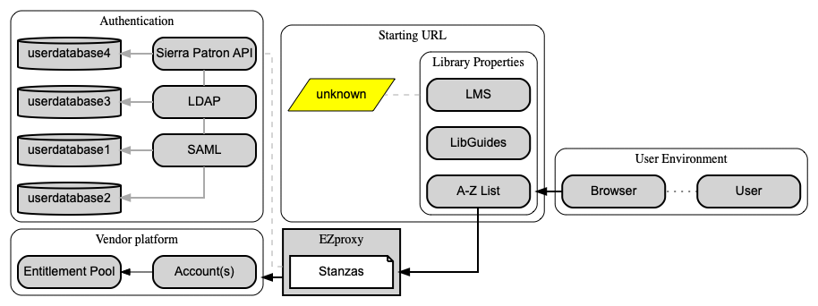
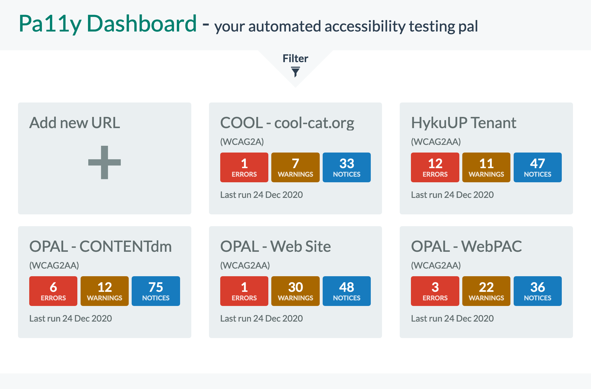
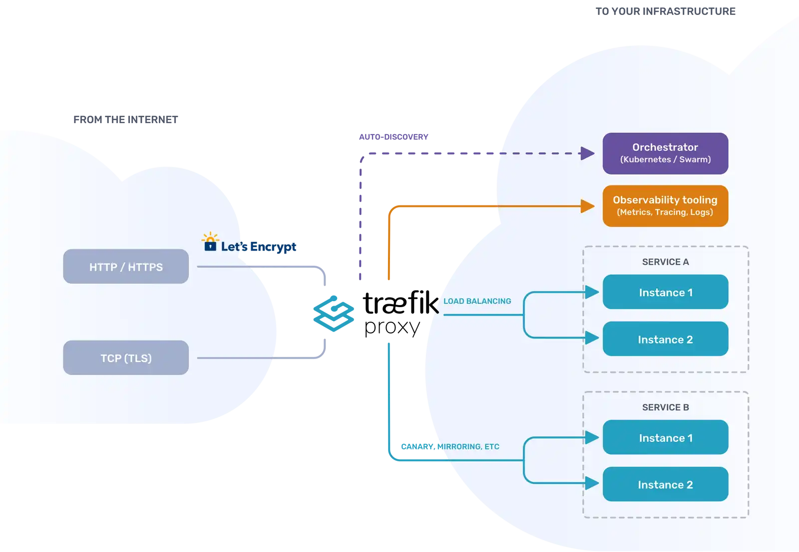
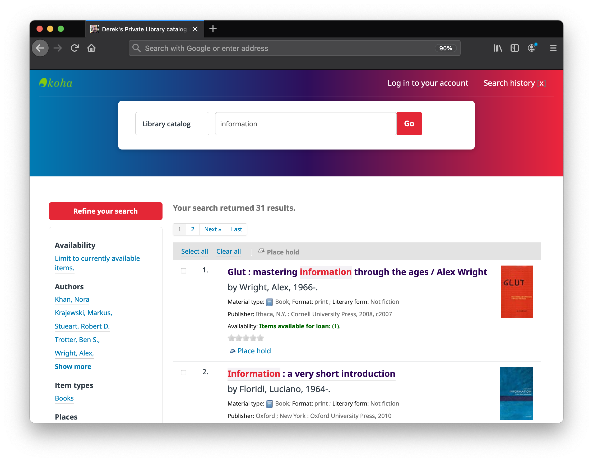

+++
date = "2021-01-01T11:00:00"
draft = false
tags = ["applications"]
title = "Apps I'm Taking into 2021"
math = false
summary = "A short list of applications that I've found useful in 2020."

# Featured image
# To use, add an image named `featured.jpg/png` to your project's folder.
[image]
   preview_only = false
#  # Caption (optional)
#  caption = ""
#
#  # Focal point (optional)
#  # Options: Smart, Center, TopLeft, Top, TopRight, Left, Right, BottomLeft, #Bottom, BottomRight
   focal_point = "Center"

+++
While it's a major challenge to identify all of the scripts, command line tools, and web-based applications that have influenced my thoughts and workflow over the previous year,
here's a set of applications that I'm excited to take with me into the new year.

### [Wax](https://github.com/minicomp/wax)
Using [minimal computing principles](https://go-dh.github.io/mincomp/), Wax is a project that aims to facilitate the creation of digital exhibits using static site technologies. For librarians exploring digital technologies at cash-strapped institutions without a formal digital initiatives program, Wax is a lightweight and cheap (in terms of cost and maintenance) solution. 

Initially, there's a rather significant technical hurdle, but the skills can be easily repurposed for use in other data-intensive projects, web development using static sites, and other metadata or library-adjacent workflows. Here are a few of the underpinning of Wax:

|     |     |
| --- | --- |
| [Jekyll](https://jekyllrb.com/) | Static Site Generator |
| [SCSS](https://sass-lang.com/documentation/syntax) | CSS Pre-processer|
| [Bundler](https://bundler.io/) | Gem Dependency Management |
| [Liquid](https://shopify.github.io/liquid/) | Templating Language |
| [YAML](https://yaml.org/) | Data Serialization Standard |
| [Bootstrap](https://getbootstrap.com/) | Front-End Frameworks |
| [Ruby](https://www.ruby-lang.org/en/) | Programming Language |
| [Markdown](https://www.markdownguide.org/) | Plain-Text Markup Language |
| [JSON](https://www.json.org/json-en.html) |Data Interchange Format |
| [Git](https://git-scm.com/) | Software Version Control |
| [Github Pages](https://pages.github.com/) | Static Site Hosting Service |

It's also a great way to learn about the International Image Interoperability Framework™ \[a.k.a [iiif](https://iiif.io/) or "Triple-I-F"\] and its associated manifest files and viewer applications like [Mirador](https://projectmirador.org/) and [OpenSeadragon](https://openseadragon.github.io/). Until I started using Wax, I hadn't considered full-text search in Javascript, which Wax provide via [Elasticlunr.js](http://elasticlunr.com/).

<figure>
  
  <figcaption style="color:grey;">Wax Workflow ⟶ see <a href="https://minicomp.github.io/wiki/wax/#so-what-does-wax-look-like">[documentation]</a></figcaption>
</figure>

To get acquainted with the Wax workflow, a photographed several of my few favorite book covers from my personal collection and created an exhibit space called the <a href="https://dzoladz.github.io/curiousitarium/collection/">Curiousitarium<sup>DCZ</sup></a>.

<figure>
  
  <figcaption style="color:grey;">Example: Book Cover Exhibit Using Wax</figcaption>
</figure>


### [graphviz](https://graphviz.org/)

Graphviz is an open source graph visualization software. Graph visualization is a way of representing structural information as diagrams of abstract graphs and networks. It has important applications in networking, bioinformatics, software engineering, database and web design, machine learning, and in visual interfaces for other technical domains.

Writing diagrams using a familiar syntax - and working in an IDE, text editor, or any another code-like environment - just feels comfortably at home. Here's the `.dot` file that generates the graph below [contextualizing-ezproxy.dot](contextualizing-ezproxy.txt)

<figure>
  
  <figcaption style="color:grey;">Resultant Graphs are Crisply-defined and Visually Appealing</figcaption>
</figure>

It also makes it easy to drop in a Python utility script that takes the `.dot` input and generates a visual representation as a `.png` file... which can be quickly and easily integrated into presentation software or any number of other productivity applications.

```python
from graphviz import Source
import os

input_file = 'contextualizing-ezproxy' + '.dot'
output_file = 'contextualizing-ezproxy' + '.png'

os.system('dot -Tpng ' + input_file + ' -o ' + output_file)

source = Source.from_file(input_file)
source.view()
```

**Here are a few tools to explore:**

- Graphviz application use case - [Contextualizing EZproxy, OhioLINK Webinar Slides](https://ohionet.github.io/ohiolink-webinar/#/)
- No installation required online tool - [Web-based Dot File Editor](http://magjac.com/graphviz-visual-editor/)
- Quick start `.dot` cheat sheet - [Graphviz Reference Documentation](https://graphs.grevian.org/reference)


### [Pa11y Dashboard](https://github.com/pa11y/pa11y-dashboard)

Pa11y Dashboard is a web-based user interface for the underlying Pa11y accessibility reporting service. The dashboard simplifies the process of actively and continuously monitoring the accessibility status of a library's service platforms.

Pa11y is an open source tool for running automated accessibility tests. Pa11y supports several common accessibility standards, including the W3C's Web Content Accessibility Guidelines 2.0 (WCAG2A, WCAG2AA, or WCAG2AAA) and the United States GSA Section 508 standards. The [aXe-core rule set](https://github.com/dequelabs/axe-core/blob/develop/doc/rule-descriptions.md) is Pa11y's default test runner suite.

<figure>
  
  <figcaption style="color:grey;">Example Dashboard</figcaption>
</figure>

If you're familiar with Docker, you can clone the following GitHub repository and have a working version of [Pa11y Dashboard in 5 minutes!](https://github.com/dzoladz/pa11y-docker)


### [Traefik Proxy](https://traefik.io/traefik/)

One of my goals for 2020 was to create a small scale application hosting platform, where I could continue my exploration into the use of containerized applications within libraries and cultural heritage institutions. In early June, a working prototype was up-and-running on a general purpose t3.large EC2 instance. Code named, Esmeralda.

**Esmeralda** is a platform for running containerized applications behind the enterprise-class reverse proxy Traefik. Containers are orchestrated via docker-compose files and [Portainer](https://www.portainer.io/products/community-edition) is used to provide a graphical interface into the entire environment.

<figure>
  
  <figcaption style="color:grey;">Diagram of Basic Traefik Workflows</figcaption>
</figure>

Traefik proxy handles:
 
- HTTP request resolution to each container service
- SSL termination
- SSL certificate issuance, renewal, and installation via [Let's Encrypt](https://letsencrypt.org/)

Traefik also provides a suite of middleware to upgrade connections to HTTPS, provide basic authentication services, among many other functions. Traefik instructions can be written directly into an application's docker-compose file, which means Traefik can configure itself automatically and dynamically as new containerized applications are deployed to Esmeralda.

### [ngrok](https://ngrok.com/)

ngrok is a cross-platform application that enables a locally-hosted web server to be exposed to the internet. Installing ngrok on the host machine is quick and simple. Once you specify the listening port of the web server, the ngrok client will: (1) initiate a secure connection to the ngrok server, (2) create a TCP tunnel on an `.ngrok.io` subdomain, and (3) route all HTTP traffic hitting the unique ngrok address to the specified port of your local host... essentially bypassing firewall restrictions and NAT mappings to expose your local machine to the internet. Pretty cool! 😎
<figure>
  
  <figcaption style="color:grey;">Cataloging My Personal Library in Koha</figcaption>
</figure>

If you've made it this far, feel free to run a search or two for items in my personal [Library Catalog](https://dzoladz-koha.ngrok.io/). 

I'm using [Koha](https://koha-community.org/) as my ILS and ngrok to expose it to the internet. I've only cataloged about 100+ items related to libraries, archives, and book history. Select you keywords accordingly. Sorry, no lending privileges yet... that's for another year.
