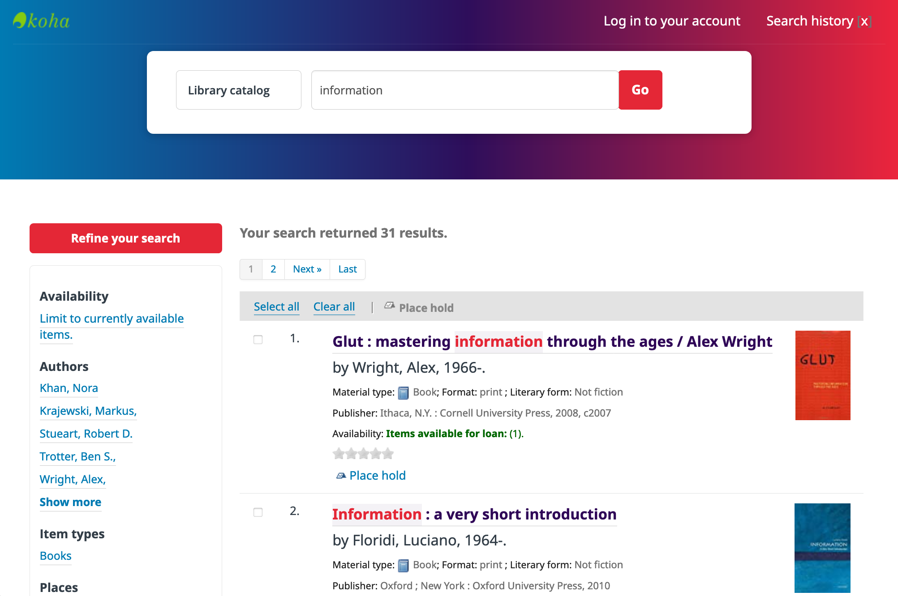

+++
date = "2020-12-24T11:00:00"
draft = true
tags = ["applications"]
title = "Apps I'm Taking into 2021"
math = false
summary = "A short list of applications that I've found useful in 2020."

# Featured image
# To use, add an image named `featured.jpg/png` to your project's folder.
[image]
   preview_only = false
#  # Caption (optional)
#  caption = ""
#
#  # Focal point (optional)
#  # Options: Smart, Center, TopLeft, Top, TopRight, Left, Right, BottomLeft, #Bottom, BottomRight
   focal_point = "Center"

+++
While it's a major challenge to identify all of the scripts, command line tools, and web-based applications that have influenced my thoughts and workflow over the previous year,
here's a set of applications that I'm excited to take with me into the new year.

### [wax]()
jekyll

### [graphviz](https://graphviz.org/)

Graphviz is open source graph visualization software. Graph visualization is a way of representing structural information as diagrams of abstract graphs and networks. It has important applications in networking, bioinformatics, software engineering, database and web design, machine learning, and in visual interfaces for other technical domains.

<figure>
  
  <figcaption style="color:grey;">results are nice</figcaption>
</figure>

Writing the diagram in familiar tools, and in code-like syntax that feels comfortable and convertible.

Slides
[Slides](https://ohionet.github.io/ohiolink-webinar/#/)

### [Pa11y Dashboard](https://github.com/pa11y/pa11y-dashboard)

Pa11y Dashboard is a web interface to the Pa11y accessibility reporter; allowing you to focus on fixing issues rather than hunting them down.

<figure>
  
  <figcaption style="color:grey;">Example Dashboard</figcaption>
</figure>

Open source

Spin it up in 5 minutes
[Dockerized Installation of Pa11y Dashboard](https://github.com/dzoladz/pa11y-docker)

### [Traefik Proxy](https://traefik.io/traefik/)

One of my goals for 2020 was to create a small scale application hosting platform to further explore the use of containerized applications within cultural heritage environments. In early June, a working prototype was built on EC2: Esmeralda. Esmeralda is platform for running Docker containers - orchestrated by Docker-Compose and a graphical interface provided by Portainer - being the enterprise class reverse proxy and load balancer, Traefik.

<figure>
  
  <figcaption style="color:grey;">Traefik Diagram</figcaption>
</figure>

Handles
 
- http request resolution to container service
- SSL termination
- automated SSL certificate issuable and installation via Let's Encrypt

Simple

- Instructions written directly into docker-compose files
- operators
- configuration is dynamically managed
- configures itself automatically and dynamically.
- middleware: upgrade to HTTPS, basic authentication, and others

### [ezPAARSE](https://ezpaarse.opal-libraries.org/)

EZproxy logs

OPAL Conference

Pilot

### [ngrok](https://ngrok.com/)

Personal library

Expose a local web server to the internet
ngrok allows you to expose a web server running on your local machine to the internet. Just tell ngrok what port your web server is listening on.

<figure>
  
  <figcaption style="color:grey;">I've only cataloged 100+ items related to libraries, archives, and book history.</figcaption>
</figure>

If you've made it this far - and you want to check out my personal library (no lending privelages yet) - feel free to have a look [Koha Running my Personal Library](https://dzoladz-koha.ngrok.io/)

