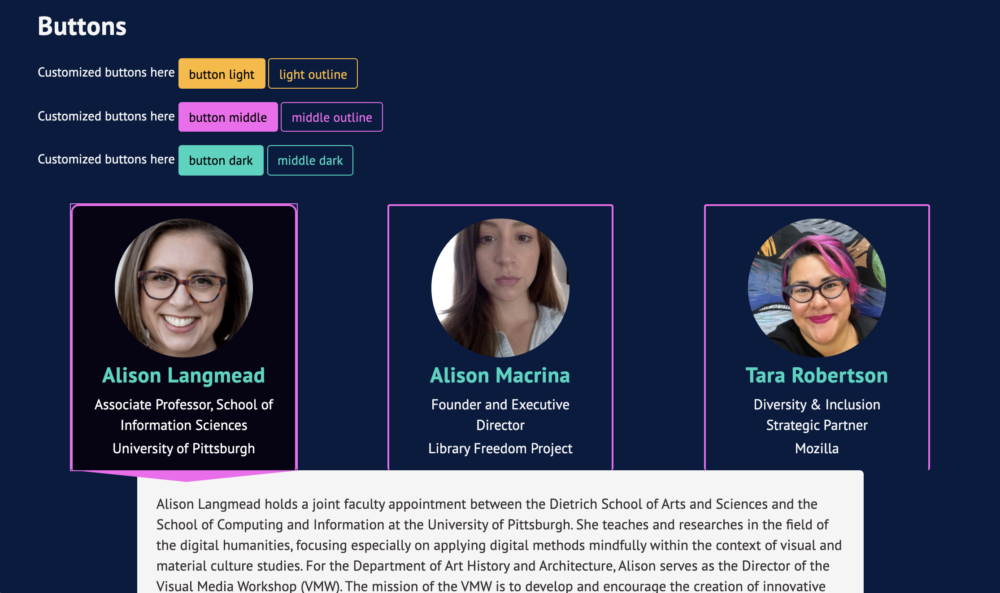

+++
date = "2021-03-01T11:00:00"
draft = true
tags = ["conferences", "Code4Lib"]
title = "Code{4}Lib 2021 - Online"
math = false
summary = "Leading the Website Working Group"

# Featured image
# To use, add an image named `featured.jpg/png` to your project's folder.
[image]
   preview_only = true
#  # Caption (optional)
#  caption = ""
#
#  # Focal point (optional)
#  # Options: Smart, Center, TopLeft, Top, TopRight, Left, Right, BottomLeft, #Bottom, BottomRight
   focal_point = "Center"

+++

Our charge, for the 2021 Website Working Group, was to focus on content strategy and new feature implementations for the first fully-online Code4Lib conference; and our primary goal was straightforward: "To improve the overall experience for users (e.g., all attendees, speakers, potential sponsors, post-conference users)"  

Site: [https://2021.code4lib.org/](https://2021.code4lib.org/)

#### Team
Members of the 2021 Website Working Group are as follows:

- Derek Zoladz (OhioNet, Chair)
- Julia Caffrey-Hill (Towson University, Co-Chair)
- Cary Gordon (Cherry Hill Company, Planning Committee Contact)
- Jerry Yarnetsky (Miami University, Documentarian)
- Ranti Junus (Michigan State University)
- Andy Hickner (Cornell University)
- Meng Qu (Miami University)

### Major Contributions

There's a lot of routine maintenance and general updating that occurs as a conference website moves through several phases (pre-conference, peri-conference, post-conference). Each phase having its own utility, purpose, and distinct set of dominant functions. And yet, at the end of the 2021 Website Working Group's efforts, there are three areas of focused improvements to highlight.

#### Design Page

theme design and application guidelines to standarize the application of recurring UI elements- typography https://2021.code4lib.org/color-test.html

#### Dark Mode

With the 2021 conference being fully online and remote, we didn't have the host city's skyline to guide the tone and choice of colors for the theme.
During our initial 
we attempted to retain a sense of place by proposing the use of a fictional city, but eventually settled on a vibrant pastel palette with geometric design.
Doing so provided us with an opportunity to create a 'dark mode', creating the overall look-and-feel for the site that was reminisent of a 1980s roller rink.

#### Accessibility Improvements

- 'Skip to content' Links - Accessibility

### Conference T-Shirt
Directly influenced by the geometric theme of this year's conference website, the winning t-shirt design prominently displayed the icosahedron. It's a surprisingly clean and minimal design that distills the spirit of the 2021 conference.

  
  
Julia Caffery-Hill's Design

