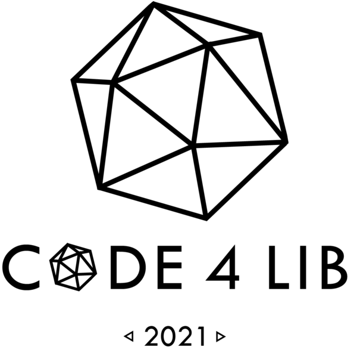

+++
date = "2021-03-01T11:00:00"
draft = true
tags = ["conferences", "Code4Lib"]
title = "Code{4}Lib - Online"
math = false
summary = "Stepping up to lead the Website Working Group"

# Featured image
# To use, add an image named `featured.jpg/png` to your project's folder.
[image]
   preview_only = false
#  # Caption (optional)
#  caption = ""
#
#  # Focal point (optional)
#  # Options: Smart, Center, TopLeft, Top, TopRight, Left, Right, BottomLeft, #Bottom, BottomRight
   focal_point = "Center"

+++
Site: [https://2021.code4lib.org/](https://2021.code4lib.org/)

### Team
Members of the 2021 Website Working Group are as follows:

- Derek Zoladz (OhioNET, Chair)
- Julia Caffrey-Hill (Towson University, Co-Chair)
- Cary Gordon (Cherry Hill Company, Planning Committee Contact)
- Jerry Yarnetsky (Miami University, Documentarian)
- Ranti Junus (Michigan State University)
- Andy Hickner (Cornell University)
- Meng Qu (Miami University)

Our charge was to focus on content strategy and feature implementations for the conference website to improve the overall experience for users (i.e., all attendees, speakers, potential sponsors, post-conference users).

#### Contribs
- Dark Mode (80s roller rink)
- 'Skip to content' Links
- Design Page

#### T-Shirt
Geometric theme inspired by this year's conference website

