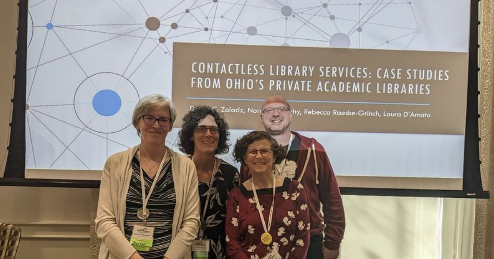
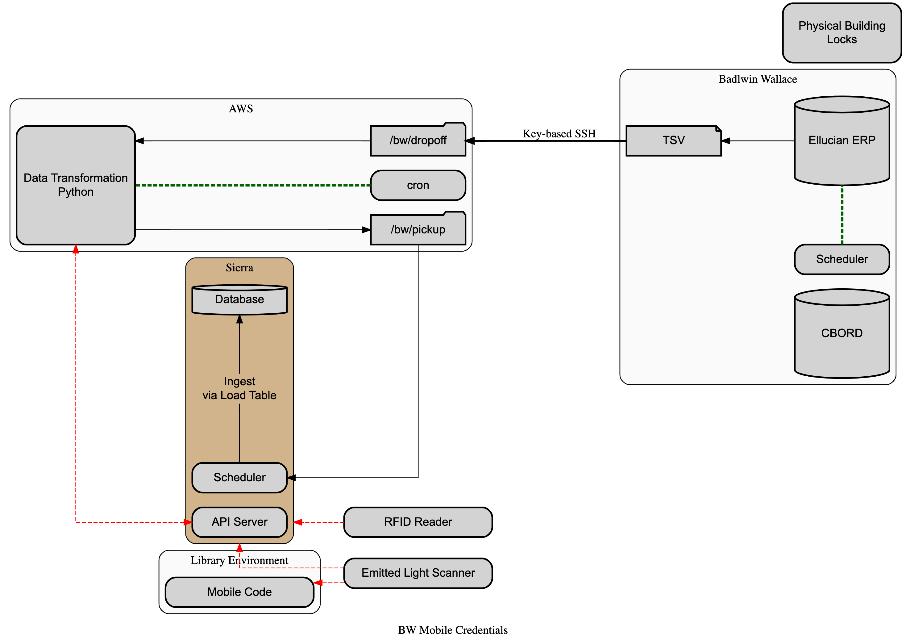
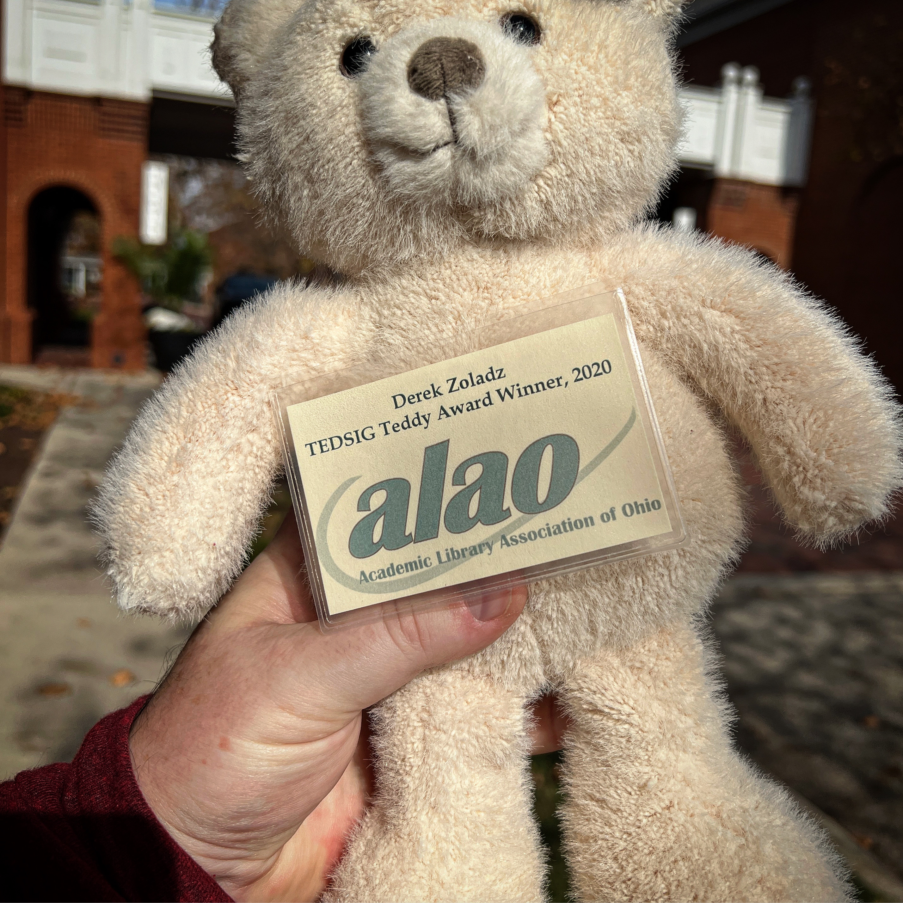

+++
date = "2022-11-04T11:00:00"
draft = false
tags = ["alao", "conferences", "technology"]
title = "Contactless Library Services & TEDDY Award"
math = false
summary = "A few photos from the 2022 ALAO Conference at the Nationwide Conference Center"

# Featured image
# To use, add an image named `featured.jpg/png` to your project's folder.
[image]
   preview_only = false
#  # Caption (optional)
#  # caption = "The OPAL presentation crew had a lot of fun!"
#
#  # Focal point (optional)
#  # Options: Smart, Center, TopLeft, Top, TopRight, Left, Right, BottomLeft, #Bottom, BottomRight
   focal_point = "Center"

+++

## As you can tell, we had a lot of fun!

The 'we' in this section refers to the folks from the [OPAL consortium](https://opal-libraries.org/) who agreed to present on the topic of contactless library services, from the point-of-view of their unique institutional context and singularly focused on a specific service.

### Presenters
| Name | Institutional Affiliation | Case Study |
|---|---| --- |
| Derek Zoladz | OhioNet | Introduction & Technical Overview |
| Rebecca Raeske-Grinch | Otterbein University | Self-Service Lockers |
| Laura D'Amato | Baldwin-Wallace University | Mobile Credentials |
| Noreen Mulcahy | Mount Carmel Health Sciences Library | Library On Demand |

### Abstract
> While contactless library services have been available for decades, there’s been a distinct shift in the design of and expectations from contactless services in the last few years. Whether accelerated by the pandemic, or by the expansion of contactless services in adjacent industries, there’s an increasing demand for simplicity and convenience of library services. A smooth user experience on the surface often involves complex behind-the-scenes procedures, requiring a depth of technical knowledge, cross-organizational communication skills, and a high level of patience and understanding as the process for creating new service models that remove barriers to accessing library resources can be burdensome.

<figure>
  
  <figcaption style="color:grey;">Co-Presenters, Before the Show <a href="../../publication/assets/contactless-library-services.pdf">[slides]</a></figcaption>
</figure>

In my role as Library Systems Anaylst at OhioNet -- and in particular my project work for the OPAL consortium -- I was often tasked with developing scripts and procedures to support disparate system integrations. The previous year included integration projects to grant library patrons the use of mobile credentials and proximity cards to checkout materials, linking records to faciliate the use of self-service lockers for contactless material pick-up outside of regular business hours, and a handful of smaller projects that required crosswalking data between platforms.

*Contactless Library Services* was the presentation that allowed us to showcase and share the exceptional capabilities of Ohio's private academic libraries with the greater library community.

<figure>
  
  <figcaption style="color:grey;">A Simplified Patron Load Diagram <a href="https://dreampuf.github.io/GraphvizOnline/?url=https://gist.githubusercontent.com/dzoladz/d9d7f8f3bf5021f7e983aa7dbfcd339d/raw/9b0445998406fc5f07d8a7abfb1a64c2e7c7a813/simplified-alao2022.gv">[code]</a></figcaption>
</figure>

## TEDDY Award

With the 2020 and 2021 conferences being fully online, the 2022 conference was the first opportunity to present TEDS to the previous years' award winners. I was selected as the TEDDY award winner in 2020, which was a prolific year of engagement with the Academic Library Association of Ohio. I was in the process of tranisitioning from a presidential appointment on the website team to an elected position as chair of the Technical, Electronic, and Digitial Services interest group.

**Here's short list of accomplishments:**
- [Speculative Library Futures | Post-Pandemic Libraries](https://futures.alaoweb.org/)
- [Critical Design and Libraries](https://tedsig.alaoweb.org/)
- Negotiating funds for the organization's website redesign
- Centralized control of ALAO web properties

**In particular, during 2020:**
- Served on the 2020 Conference Planning Committee
- Technical lead for all conference-related ALAO projects.
- Organized a team of librarian from around the state to develop the online conference's platform, see the [2020 conference site](https://2020.alaoweb.org/)

**In the words of my nominator:**
> Derek has worked tirelessly over the last five years to enhance ALAO's technical portfolio and internal processes. From recovering and centralizing the administration of ALAO's web properties, to instituting a role-based model of account creation in order to facilitate knowledge transition and succession planning, Derek's commitment to strengthening Ohio's academic library community through service to ALAO is unmatched. While securing the funding for ALAO's website redesign, and providing the initial guidance for the project, Derek generously shared his knowledge through a hands-on approach to mentoring colleagues. Derek was the project lead for the development of the 2020 Virtual Conference website, whose code has been gifted back to ALAO under an MIT license.

<figure>
  
  <figcaption style="color:grey;">TEDS, the TEDSIG Mascot <a href="https://www.alaoweb.org/igs/tedsig/index.html">[website]</a></figcaption>
</figure>

It's a honor to be among the winners of the TEDDY. It's a wonderfully, accomplished group that is dedicated to the work of academic libraries and the communities they serve.