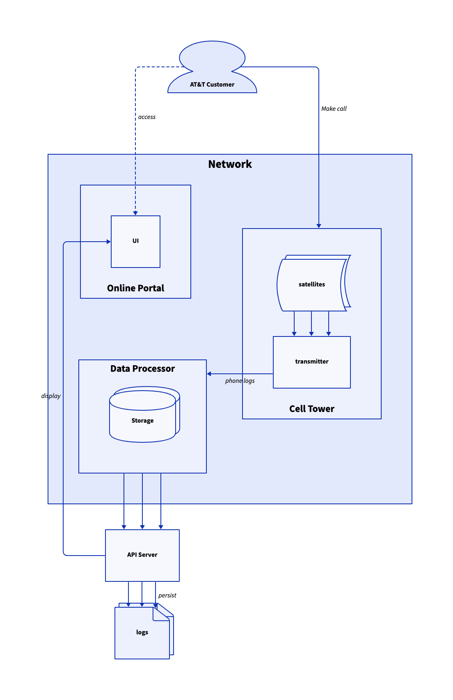
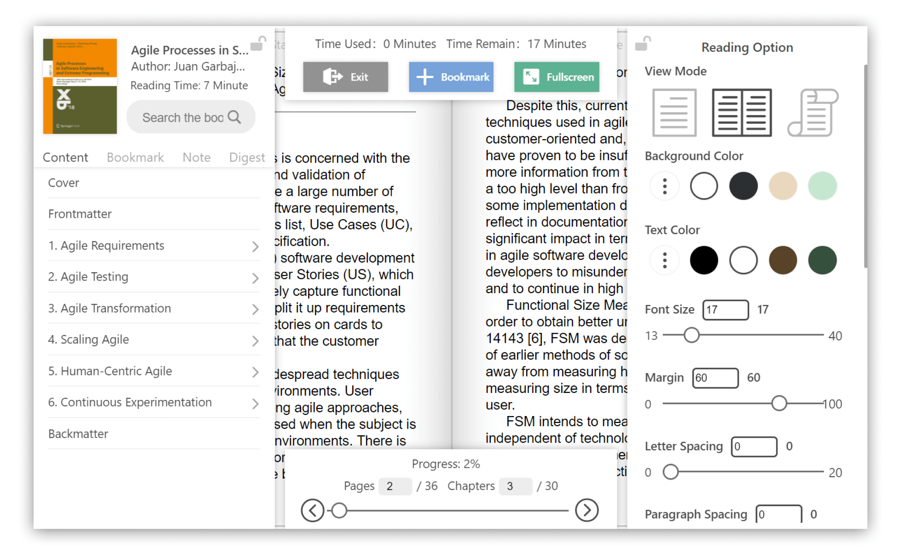
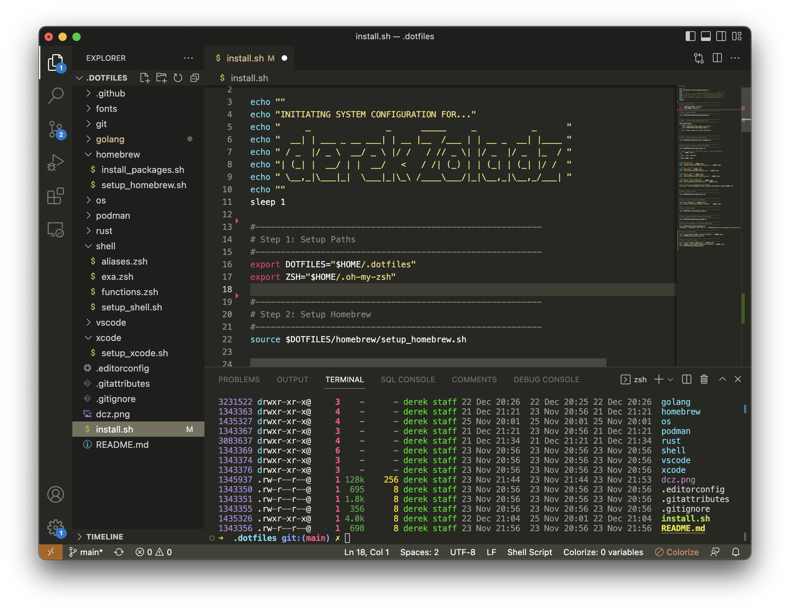

+++
date = "2022-12-23T11:00:00"
draft = false
tags = ["applications"]
title = "Apps I'm Taking into 2023"
math = false
summary = "A short list of applications that I've found useful in 2022."

# Featured image
# To use, add an image named `featured.jpg/png` to your project's folder.
[image]
   preview_only = false
#  # Caption (optional)
#  caption = ""
#
#  # Focal point (optional)
#  # Options: Smart, Center, TopLeft, Top, TopRight, Left, Right, BottomLeft, #Bottom, BottomRight
   focal_point = "Center"

+++
While it's a major challenge to identify all of the scripts, command line tools, and web-based applications that have influenced my thoughts and workflow over the previous year,
here's a set of applications that I'm excited to take with me into the new year.

### [D2](https://d2lang.com/tour/intro/)

Visual expressions are a regular and important part of the documentation process. I organize my thoughts and presentations with diagrams, so it's not surprising that I've discovered another tool to add to my arsenal. Last year, it was [mermaind.js](https://mermaid.js.org/). For this coming year, I'll be exploring D2.

[D2](https://d2lang.com/tour/intro/) is a declarative, diagramming language. In the simplest terms, you describe the end state of a diagram in text, while D2 renders the textual definitions into a image of the diagram.

<figure>
  
  <figcaption style="color:grey;">Diagram Rendered by D2 <a href="https://d2lang.com/tour/install">[documentation]</a></figcaption>
</figure>

### [Koodo Reader](https://github.com/troyeguo/koodo-reader)

Koodo Reader is a cross-platform, open source reader for a variety of common ebook formats and document types. Binaries are available for Windows, macOS, and all Linux distributions. There's also a a web-based implementation, if you prefer to run the reader on localhost. I've been using this application for several months now. Although there are a few quirks at times with the reflowing to text, the ability to easily access documentation in a book-like manner has been quite fun.

Format support:
* EPUB (.epub)
* Scanned document (.pdf, .djvu)
* DRM-free Mobipocket (.mobi) and Kindle (.azw3)
* Plain text (.txt)
* FictionBook (.fb2)
* Comic book archive (.cbr, .cbz, .cbt)
* Rich text (.md, .docx, .rtf)
* Hyper Text (.html, .xml, .xhtml, .htm)

<figure>
  
  <figcaption style="color:grey;">Koodo Reader Interface <a href="https://koodo.960960.xyz/en">[documentation]</a></figcaption>
</figure>

If you're on macOS and using Brew as your package manager, installation couldn't be simpler.

```
brew install --cask koodo-reader
```

### [Gitea](https://gitea.io/en-us/)

For the better part of the last six year, I've contributed the majority of my code to public and private repositories on Microsoft's GitHub platform. Starting with my employment at the [Ohio Public Library Information Network](https://www.oplin.ohio.gov/), I'll be contributing a lot more of my code to our internal Gitea instance.

Perhaps you've spotted a trend of using open source solutions, whenever possible. Gitea is no different. Gitea is an open source, git-based version control system. At OPLIN, we self-host a number of applications that faciliate our daily work, monitor our services to Ohio's public libraries, and maintain our internal knowledge base and business processes. While Gitea lacks some of the out-of-the-box features I'm familiar with on GitHub, those missing features were value-add rather than mission critical. The improved securty of our internal applications are well worth these minimal tradeoffs.

### [Metatext](https://github.com/metabolist/metatext)

With the implosion of the bird-site at the end of 2022, I'm moving to a "Mastodon first" approach. Metatext is the iPhone app that I'm using to interact with the fediverse. It's a free, open source [Mastodon](https://joinmastodon.org/) client. With the rapid, exponential growth of Mastodon's community over the last few weeks, Metatext is looking for new maintainers to ensure the viability of an open source iOS client into the future.

Care to connect? You can find me on the extremely small [Code4Lib](https://code4lib.org/about/) instance at `@derekz@code4lib.social`. 

### [VS Code](https://code.visualstudio.com/)

During my tenure at OhioNet, I was exclusively working with PyCharm as my integrated development environment. PyCharm is a complete solution for Python development. IntelliJ's philosophy is along the lines of, "Here are the best in class tools, go forth". Launch the application and you're ready to write code.

Visual Studio Code is more of a "Roll your Own" solution. Out-of-the-box, it's a blank slate that you customize through extensions. The difficulty is not the availability of customization options. There are a plethora of extensions in the marketplace. The challenge is finding the robust and lightweight set of extensions that possess the features that you require, without too much in the way of creating a time-consuming administrative nightmare.

Here are a few extentions I'm using:
* [SQLTools](https://vscode-sqltools.mteixeira.dev/en/home/)
* [VS Code Python](https://github.com/Microsoft/vscode-python)
* [Python Indent](https://github.com/kbrose/vsc-python-indent)
* [Indent Rainbow](https://github.com/oderwat/vscode-indent-rainbow#indent-rainbow)
* [CSV Rainbow](https://github.com/mechatroner/vscode_rainbow_csv)

<figure>
  
  <figcaption style="color:grey;">Visual Studio Code IDE <a href="https://code.visualstudio.com/">[website]</a></figcaption>
</figure>
