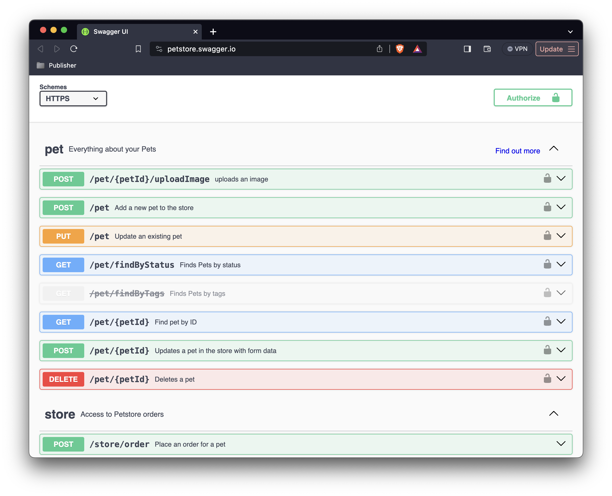

The previous year has brought an increased focus on the Python programming language. In particular, web frameworks and 
libraries using to facilitate full-stack application development. My day-to-day activities at OPLIN (Ohio Public 
Library Information Network) involve the creation, maintenance, and implementation of new features for a suite of 
custom applications that enable OPLIN's internal workflows and processes in support of Ohio's 251 public libraries. 
Here's a set of applications that I'm excited to take with me into the new year.

### [FastAPI](https://fastapi.tiangolo.com/)

[FastAPI](https://fastapi.tiangolo.com/) is a Python web framework for creating enterprise-grade, production-ready APIs (Application Programming 
Interfaces). FastAPI builds upon [Starlette](https://www.starlette.io/), a powerful toolkit for engineering asynchronous
web services in Python. FastAPI has an amazing set of out-of-the-box features including: (1) inbound and outbound data 
validation, (2) authentication support for OAuth2, JSON web tokens, and basic auth, and (3) a robust middleware and 
dependency injection system for extending built-in services or easing the integration path for alternatives.

[Uvicorn](https://www.uvicorn.org/), a low-level ASGI (Asynchronous Server Gateway Interface) server loads and serves 
a FastAPI application. Uvicorn's live reloading feature is useful for viewing code changes quickly during development; 
but for production apps, you'll want to add [Gunicorn](https://gunicorn.org/) as a Uvicorn process manager to ensure a 
healthy state of worker processes to handle web requests destined for your FastAPI application.

Interactive API documentation is also automatically generated by FastAPI, using either [Swagger UI](https://swagger.io/tools/swagger-ui/)
or [ReDoc](https://redocly.com/docs/redoc/) as the output format. In a nutshell, it's an amazing framework for rapidly 
prototyping a demo and/or designing an enterprise-grade API applications.

<figure>
  
  <figcaption style="color:grey;">Swagger UI <a href="https://swagger.io/tools/swagger-ui/">[documentation]</a></figcaption>
</figure>

### [Pydantic](https://docs.pydantic.dev/latest/)

The inbound and outbound data validation features of FastAPI are provided by Pydantic, a validation and serialization 
library for Python built on [Rust](https://www.rust-lang.org/). Pydantic takes advantage of Python's native type hints 
and dataclasses to facilitate its magic, which includes type coercion of untrusted data by default. Pydantic models 
are standard Python classes that inherit from Pydantic's BaseModel. Define a model, pass it some untrusted data, and 
"Pydantic guarantees that the fields of the resultant model will conform to the field types defined on the model".

Adhering to [JSON Schema](https://json-schema.org/specification) standards; thus, enabling the auto-generation of 
[OpenAPI Specification 3.x](https://spec.openapis.org/oas/latest.html) compliant documentation, Pydantic models are 
self-documenting. Because of their strict implementation and adherence to standards, Pydantic models can be generated 
from a wide variety of originating sources by building the necessary translation layer from a solid and well-defined 
foundation.

<div style="width:100%; display: flex; justify-content: center;">
  <iframe width="560" height="315" src="https://www.youtube.com/embed/aHv7-6WIxNM?si=t9Ysls5f9uHpnwz0"
  allow="accelerometer; autoplay; clipboard-write; encrypted-media; gyroscope; picture-in-picture; web-share" 
  allowfullscreen>
  </iframe>
</div>

### [SQLAlchemy](https://www.sqlalchemy.org/)

[SQLAlchemy](https://www.sqlalchemy.org/) is a enterprise-grade, high performance toolkit for working with relational databases using either 
native Python or direct SQL statements. After working with the Evergreen ILS system for several 
years, I've been using [Postgres](https://www.postgresql.org/) as my preferred relational database for almost any task. I'm also using the
latest version of [Psycopg](https://www.psycopg.org/) as my Postgres adaptor. Psycopg wraps [libpq](https://www.postgresql.org/docs/current/libpq.html) and fully-implements [PEP 249](https://peps.python.org/pep-0249/).
It suits my needs quite well, but I'm open to trying alternatives. 

#### Core and ORM (Object Relational Mapper)

<figure>
  
  <figcaption style="color:grey;">Engine and Connection Architecture <a href="https://docs.sqlalchemy.org/en/20/core/engines.html">[documentation]</a></figcaption>
</figure>

SQLAlchemy has two components: Core and ORM.

**Core** provides the resources for defining the dialect of the underlying database and creating a connection to execute
database transactions. SQLAlchemy's engine object, a component of core, provides the fundamental methods for 
establishing a database connection. The engine provides low-level statement execution and can be used to talk directly 
to the database via SQL statements.

Core also has a system for listening to common database events and triggering arbitrary code in response. This system 
allows for the programmatic execution of tasks like attaching triggers after table creation, loading test data on 
application startup, or anything you can dream up. It's phenomenally flexible.

**ORM** (Object Relational Mapper) provides a method of working with relational databases using native Python data 
structures. The ORM is a essentially a translation layer between the data representation used by a database and those 
used in object-oriented programming like Python. SQLAlchemy's ORM enables the amazing ability to code a single Python 
class, known as a Declarative Mapping, that simultaneously defines both the Python object model and the metadata that 
describes a real SQL table in a Postgres database.

Below is an illustrative example of a declarative mapping of a User object:

```python
from sqlalchemy.orm import declarative_base

Base: declarative_base()

class User(Base):
  __tablename__: "user_account"
  
  id: Mapped[int]: mapped_column(primary_key=True, index=True)
  first_name[str]: mapped_column(String(50))
  last_name[str]: mapped_column(String(50))
  fullname: column_property(f'{firstname} {lastname}')
  address: Mapped['Address']: relationship(Address, back_populates='user')
  email: Mapped[EmailStr]: mapped_column(EmailStr)
```

As you can see, SQLAlchemy provides a Declarative Base that can be extended to define our metadata. Most often, metadata 
refers to “data that describes data”; a representational expression of the format and/or structure of some other kind 
of data. In SQLAlchemy, metadata refers to the MetaData construct, which is a collection of information about the 
tables, columns, and constraints that exist in a database.

SQLAlchemy makes it simple to establish a database connection, but the complexity curve *very* quickly begins to rise.
Implementing SQLAlchemy is a commitment to learning both the toolkit and how relational databases work. You'll need to 
be prepared to make a significant time investment. Choose wisely!

### [HTTPX](https://www.python-httpx.org/)

Issuing HTTP requests is a daily occurrence. This is my active replacement for the venerable 
[Requests](https://requests.readthedocs.io/en/latest/) module that I've long used in my Python projects. It's 
basically a drop in swap with little to no script modification required. Using [Pipx](https://pipx.pypa.io/stable/) 
to install HTTPX in an isolated environment, I'm able to take advantage of it from the command line to run quick tests. 

HTTPX is like a good friend: reliable, trustworthy, and ready for any adventure! 

<figure>
  
  <figcaption style="color:grey;">HTTPX Logo</figcaption>
</figure>

### [Airflow](https://airflow.apache.org/)

This is one that I happened to see demonstrated during a session at [PyOhio 2023](https://www.pyohio.org/2023). Fundamentally, AirFlow is a 
task scheduler with a web-based frontend to monitor workflows. Tasks can be written in pure Python and executed at 
fixed intervals or on specific dates. Unlike cron on Unix-based systems, which excels at scheduling and triggering 
independent tasks. AirFlow excels at tasks that are dependent upon the successful completion of a previous task. 
Although there are obvious applications for automating system maintenance and administration tasks, I'm going to 
explore the possibilities of data transfer and transformation workloads in 2024.

## Extras, extras?

I suppose these aren't really extras, as I know I'll be incorporating these technologies into my personal toolkit in 
the coming year. Working with PHP code has become a part of my everyday routine, so I'll need to become increasingly 
familiar with the tooling used by this interpreted language. I'll also be exploring what frameworks are available for 
developing front-end applications in 2024. JavaScript makes an appearance to implement the front-end side of the 
full-stack equation, but that's a fresh topic for the upcoming year.

<div id="table2024">

| Language        | Tool                                            | Description               |
|-----------------|-------------------------------------------------|---------------------------|
| PHP             | [Composer](https://getcomposer.org/)            | Package Manager           | 
|                 | [Guzzle](https://docs.guzzlephp.org/en/stable/) | HTTP client               |
| JavaScript      | [Next.js](https://nextjs.org/)                  | Full-Stack Web Framework  |
|                 | [sli.dev](https://sli.dev/)                     | Presentations Slides      |
| Python          | [Wagtail](https://wagtail.org/)                 | Content Management System |
|                 | [Ruff](https://docs.astral.sh/ruff/)            | Linter and Code Formatter |
| Infrastructure  | [Nginx](https://www.nginx.com/)                 | Reverse/Caching Proxy     |
|                 | [PyVmomi](https://github.com/vmware/pyvmomi)    | VMWare Automation         |

</div>

<style>
div#table2024 > table {
  display: table;
}
</style>

Happy New Year! 🥳
