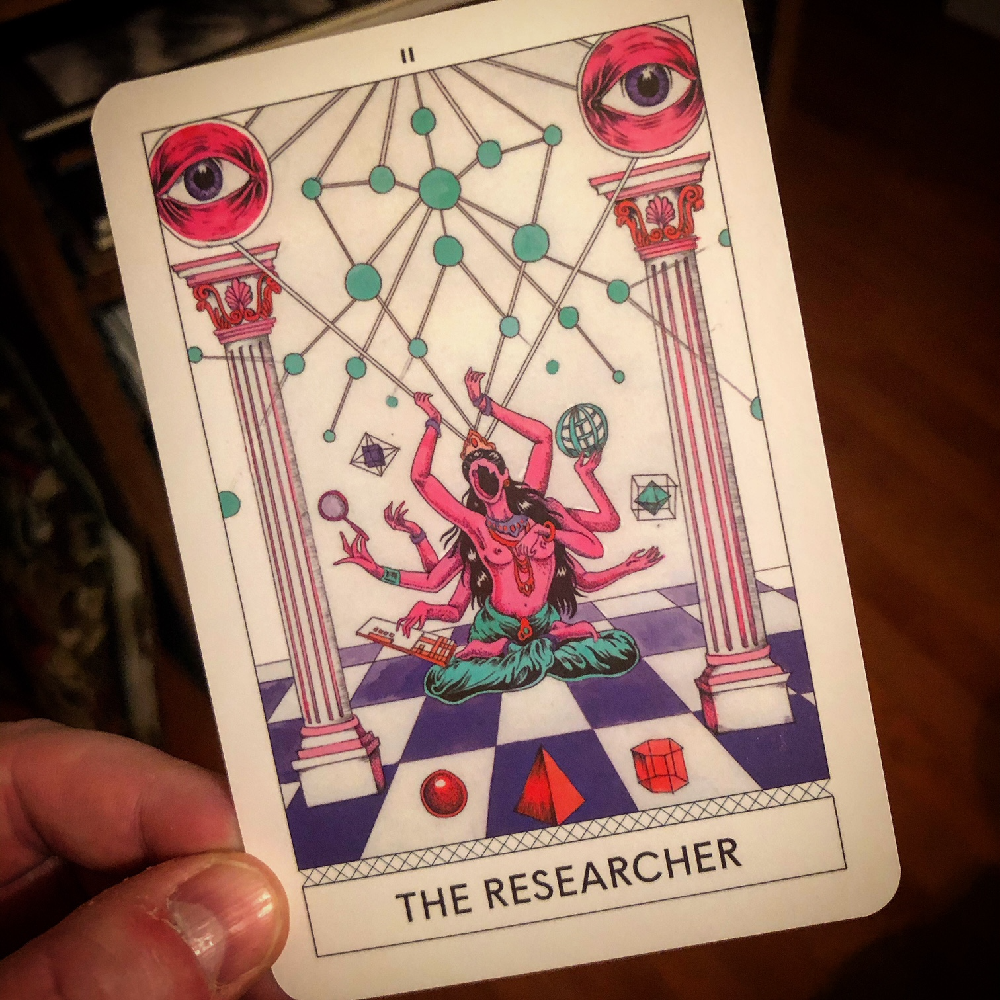

+++
date = "2020-10-28T11:00:00"
draft = true
tags = ["conferences"]
title = "Design After the End of the World"
math = false
summary = "Speculative Design & Climate Change"

# Featured image
# To use, add an image named `featured.jpg/png` to your project's folder.
[image]
   preview_only = false
#  # Caption (optional)
#  caption = ""
#
#  # Focal point (optional)
#  # Options: Smart, Center, TopLeft, Top, TopRight, Left, Right, BottomLeft, #Bottom, BottomRight
   focal_point = "Center"

+++
readings
- Speculative Everything
- Amitov Ghosh
activities
- tarot
- future flip
- object from the sea
latitude
- intro

