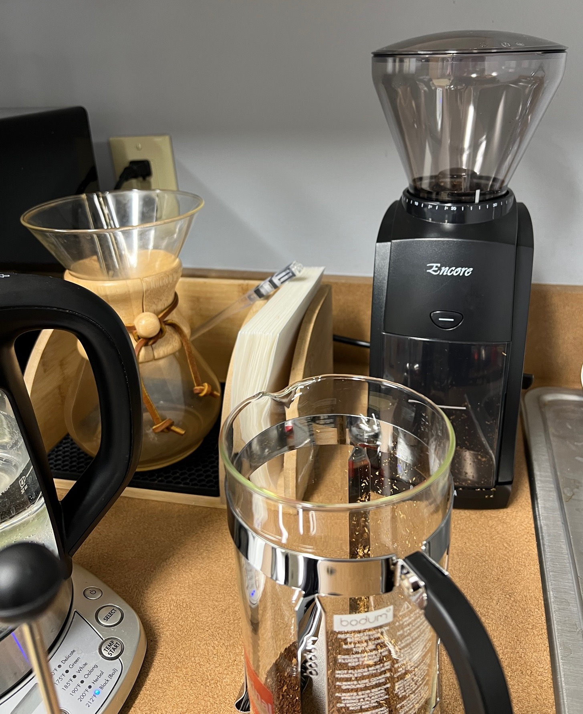
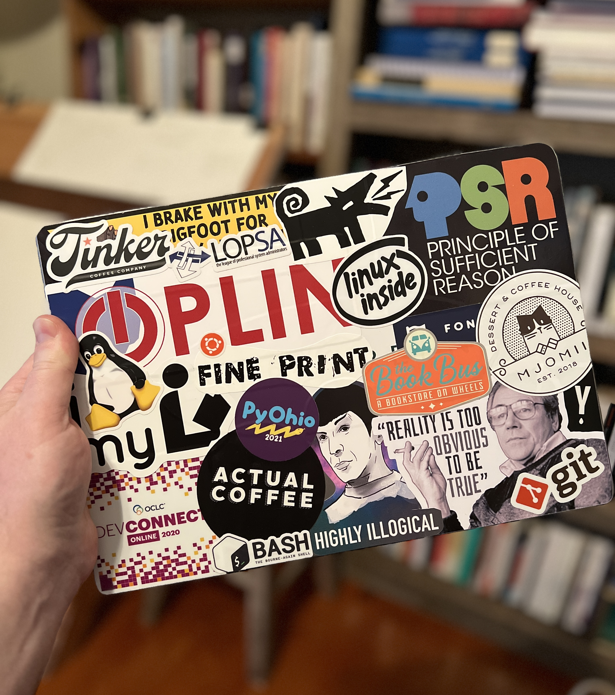

+++
date = "2022-11-28T11:00:00"
draft = false
tags = ["career", "technology"]
title = "Hello OPLIN! 🎉"
math = false
summary = "A fresh set of challenges and new opportunities to serve Ohio's public libraries"

# Featured image
# To use, add an image named `featured.jpg/png` to your project's folder.
[image]
   preview_only = true
#  # Caption (optional)
#  caption = ""
#
#  # Focal point (optional)
#  # Options: Smart, Center, TopLeft, Top, TopRight, Left, Right, BottomLeft, #Bottom, BottomRight
   focal_point = "Center"

+++

After six years at OhioNet, I'm thrilled to announce that I've accepted a position as Software Developer 
at the Ohio Public Library Information Network. In this capacity, I'll be able to continue building my 
technical skills (breadth and depth) in support of Ohio's vibrant public libraries.

My initial tasks will be: (1) migrating OPLIN's legacy ticketing system into an open source platform called 
<a href="https://osticket.com/" target="_blank">osTicket</a>, (2) leading <a href="https://www.oplin.ohio.gov/services/authentication" 
target="_blank">OPLIN's authentication services</a> for statewide resource access, and (3) supporting, maintaining, and 
expanding the code base developed by Karl Jendretsky over the past 18 years. I can't wait to hit the ground running.
 

<figure>
  
  <figcaption style="color:grey;">Placard for the OPLIN Office Suite <a href="https://www.oplin.ohio.gov/buildinginfo">[website]</a></figcaption>
</figure>

One of my first purchases for the new office?

Adding a burr grinder to our assortment of coffee preparation devices. OPLIN has the most extensive collection of 
coffee making tools that I've ever encountered in a office space (e.g., french press, pour-over, chemex). Which, 
of course, I adore and support 💯. A cup of freshly ground <a href="https://www.morrisoncoffee.com/" target="_blank">
Morrison Coffee</a> in the morning is the perfect way to start the morning.

<figure>
  
  <figcaption style="color:grey;">Baratza Encore Burr Grinder</figcaption>
</figure>

Where is all of this action is going to take place?

On my new laptop Apple M1 MacBook Pro! I can't express how stoked I am to have this machine as my daily 
driver. Having spent the last 5 years on a MacBook Pro with those pesky butterfly mechanism issues (e.g., repeating 
characters, unresponsive keystrokes), it's a dream to once again have a rock solid keyboard. I tend to be a heavy 
typer, so I'm crossing my fingers that these triggers will perform for years to come.

<figure>
  
  <figcaption style="color:grey;">Apple M1 MacBook Pro with Stickers</figcaption>
</figure>

