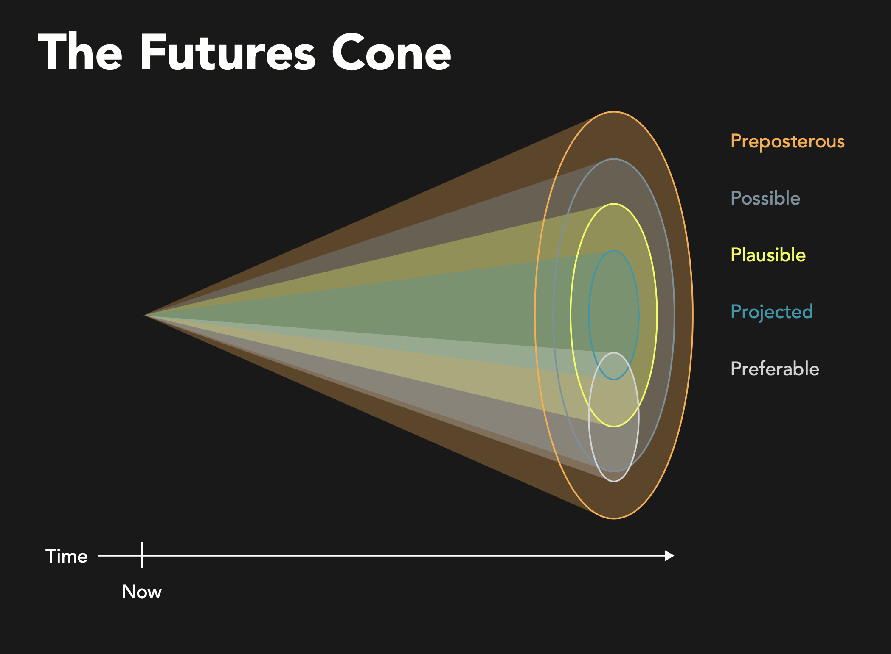

+++
# Date this page was created.
date = "2021-03-15"
active = true
draft = false

# Project title.
title = "Speculative Library Futures"

# Project summary to display on homepage.
summary = "A yearlong exploration of speculative design and libraries by TEDSIG" 

# Optional image to display on homepage (relative to `static/img/` folder).
image_preview = "tedsig_futures/featured.png"

# Tags: can be used for filtering projects.
tags = ["technology", "TEDSIG", "ALAO"]

# Optional external URL for project (replaces project detail page).
#external_link = ""

# Featured image
# To use, add an image named `featured.jpg/png` to your project's folder.
[image]
   preview_only = true
#  # Caption (optional)
#  caption = ""
#
#  # Focal point (optional)
#  # Options: Smart, Center, TopLeft, Top, TopRight, Left, Right, BottomLeft, #Bottom, BottomRight
   # focal_point = "center"

+++

  

    <strong>Speculative Library Futures | Post-Pandemic Libraries</strong> is the culmination of a yearlong exploration of speculative design and libraries by <a href="https://www.alaoweb.org/igs/tedsig/index.html/">TEDSIG</a>, the Technical, Electronic, and Digital Services Interest Group of the <a href="https://www.alaoweb.org/">Academic Library Association of Ohio</a>.
  

- Publication: [Speculative Library Futures | Post-Pandemic Libraries](https://futures.alaoweb.org)
- doi: [doi.org/10.5281/zenodo.4606860](http://doi.org/10.5281/zenodo.4606860)

<!-- Article Teasers -->

[Speculative Card Deck](https://futures.alaoweb.org/speculative-deck.html/) by Mackenzie Salisbury and Shannon Marie Robinson integrates Guy Debord's dérive into a beautifully-designed, critical deck of prompts and actions to generate situations that disrupt the traditional use value assigned to the library.

[Notes on a Speculative Design Reading Group](https://futures.alaoweb.org/notes-on-a-speculative-design-reading-group.html/) by John Jung reflects on the conversations with artists, designers, and librarians that emerged during “Design After the End of the World”, a speculative design reading group at Chicago’s community lab LATITUDE.

[Hair Catalog](https://futures.alaoweb.org/hair-catalog.html/) by Shannon Marie Robinson applies metadata of forensic examination to describe an object, highlighting how traditional metadata, such as title and author, influence discovery and control the development of new knowledges.

[Alternative Art History](https://futures.alaoweb.org/alternative-art-history.html/) by Shannon Marie Robinson reconfigures the relations between archival memory, meaning-making, and how we query knowledge, by shifting away from the dominant perspective of the author and towards the preservation of scholarly communication between readers.

[Tech to You](https://futures.alaoweb.org/tech-to-you.html/) by Myiesha Speight and Bria Sinnott accepts the disintegration of the library as a physical place to explore fundamental questions about the qualifications of librarianship and the definition of impactful public services.

[Growing Through the Cracks](https://futures.alaoweb.org/growing-through-the-cracks.html/) by Heidi Beke-Harrigan and Katie DeJongh asks us to accept stillness as a mode of generative thought, one that encourages optimistic and parallel futures to sprout from a nurturing and reciprocal dialogue between image and haiku.

[Alexandr.ia](https://futures.alaoweb.org/alexandria.html/) by Calvin Cleary and Liz Lang is a dystopian look at the future of precarity in academic libraries, which takes the form of a satirical pitch to Silicon Valley investors for an app called Alexandr.ia.

<!-- Article Teasers -->

### Background

The origin of this work finds its roots just off of exit 50, southbound interstate 70, in a rural Holiday Inn. It was a late October afternoon – at an oddly remote conference center in Wilmington, Ohio.  I was listening to a presentation from [John Jung](https://johnjung.us/) and [Kathy Zadrozny](https://kzadrozny.com/), both from the University of Chicago, about the use of design fiction – specifically, the creation of believable near-future stories to explore the social, cultural and ethical aspects of technological change. The year was 2016 and this presentation made a deep and lasting impression on me.

  
  
©2021 OpenStreetMap Contributors | <a href="https://opendatacommons.org/licenses/odbl/summary/">ODbL 1.0 license</a>

Fast-forward to 2018, when I became co-chair of TEDSIG in July. Taking the interest group in a fresh direction was an intentional decision. Rather than continue to facilitate workshops and schedule learning opportunities that focused on the day-to-day tooling that enables library-specific technical work, I wanted to use this opportunity to reinvigorate our group by reflecting on first principles and foundations. Accepting that many of our existing library systems are reaching the limits of their effectiveness served as a premise to encourage us to consider alternative futures. However, to avoid a future that merely recapitulates both the positive and negative aspects of our present solutions, we needed to think critically about the design of our future.

[TEDSIG 2020](https://tedsig.alaoweb.org/) invited John Jung to present an hour-long exploration of Speculative/Critical Design and Libraries. Speculative design attempts to open our minds to new ways of thinking and being, where traditional design attempts to solve problems. Speculative design holds promise for libraries as a way to problematize our present by exposing the pre-existing conditions of our current reality. Thomas Moynihan: "We perceive the world as anticipations of its future". It is our capacity to envision the future that propels us forward.

> "We perceive the world as anticipations of its future"

Attendees of TEDSIG 2020 were invited to continue the exploration by participating in an 8-week speculative design and climate reading group co-facilitated by [Renee Albrecht-Mallinger](http://www.reneelynn.com/) and John Jung. Beginning in September 2020, [Design After the End of the World](https://dzoladz.github.io/2020-reading-group/) was hosted by the artist community space [LATITUDE \| Chicago](https://www.latitudechicago.org/). The outcome of this group’s work resulted in the call for proposals for a Speculative Library Futures web-based publication, of which the resulting contributions are included above.
